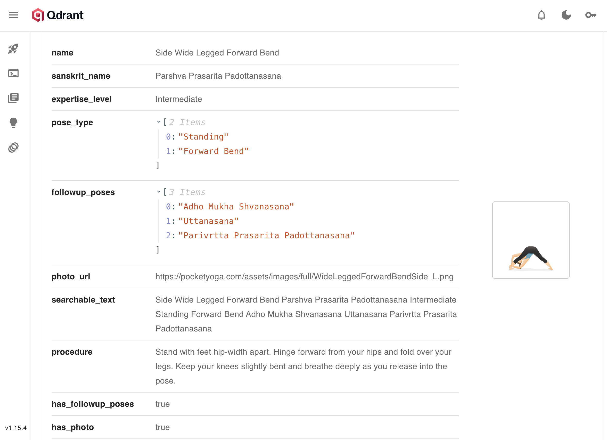

# SoloScaleYoga 🧘‍♀️

Welcome, yoga teachers! 🌟

Are you ready to create unforgettable classes and build a thriving student community? Our project brings you **three powerful MCP servers**—designed to make your teaching easier, more engaging, and more impactful.

**Why SoloScale Yoga MCP?**
- The global wellness industry is booming ($4.5+ trillion!), yet over **300,000 yoga teachers** face scattered tools and wasted time.
- Most teachers juggle **5–7 different apps** for planning, engagement, and pose correction—leaving less time for what you love: teaching.

**Our Solution:**  
A unified, all-in-one MCP based platform  that streamlines your workflow, so you can:
- **Plan creative sequences** effortlessly
- **Connect with students** and foster loyalty
- **Guide poses** with smart, gentle feedback
- **Create Content** additional stream of income and keep your sweet voice flowing ✨

Focus on inspiring your students and growing your business—let us handle the rest

## Our Servers & Where to Find Them 🔍

| Server | Branch | What It Does |
|--------|--------|-------------|
| **LeYogaSeqEnz** | `feature/sruthi_alpic_deployment` | Creates personalized yoga sequences with voice guidance - perfect for when you need inspiration for your practice! |
| **LeYogaCommunity** | `feature/danushkumar_discord` | Connects you with fellow yogis to share sequences and get feedback - because yoga is better together! |
| **LeYogaPoseCrct** | `feature/sabarish_post_corrector` | Helps improve your poses with gentle guidance and alignment tips - like having a teacher in your pocket! |

### Note:
- Created an audio demo in a separate server that can be extended for content creation. For demo purposes, we're keeping it in beta—introducing **LeYogaContentCrte**!
- We whipped up a Qdrant database for our Yoga pose collection—meet **QdrantLeYogaSequence**! It’s packed with curated poses and info to help you build smart, personalized sequences. It’s ready to roll on Alpic, but since it’s a big deployment, we’re holding off on hosting it for now.

| Server | Branch | What It Does |
|--------|--------|-------------|
| **LeYogaContentCrte** | `feature/sruthi_alpic_deployment_audio_render` | Audio demo server for creating and sharing yoga content—currently in beta for experimentation and feedback! |
| **QdrantLeYogaSequence** | `feature/sruthi_qdrant_mcp` | Curated multi-modal yoga pose database for building smart, personalized sequences—ready for deployment and future expansion! |

## Help From Our Friends 💫

These servers were built with love (and lot of help from Mistral Medium and Claude Sonnet), So we really vibe coded it :D

Want more details? Check out the specific branch for each server!

Namaste 🙏
